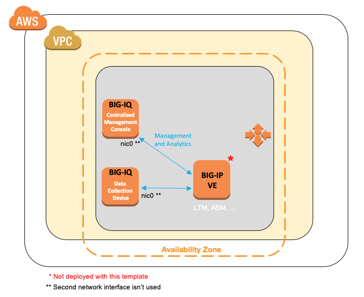

BIG-IQ Centralized Management Trial Quick Start - AWS
=====================================================

**Note:** This template uses BIG-IQ 8.2.0



Instructions for AWS
--------------------

<p align="center"><a href="https://www.youtube.com/watch?v=pgdcLOmKxtQ" target=”_blank”>Watch the Video Tutorial for AWS<br/>
</a></p>

To deploy this CFT in AWS, complete the following steps.

*Expected time: ~15 min*

**Note:** This template is not supported in the Paris region, AWS GovCloud and AWS China.

1. To get a BIG-IQ trial license, go to [F5 Trial](https://f5.com/products/trials/product-trials).

   Select **BIG-IP VE and BIG-IQ**

2. Subscribe and accept the Terms and Conditions for these F5 products:

   * [F5 BIG-IQ Virtual Edition - (BYOL)](https://aws.amazon.com/marketplace/pp/B00KIZG6KA)

3. Launch the *trial stack* template by right-clicking this button and choosing **Open link in new window**:

   <a href="https://console.aws.amazon.com/cloudformation/home?region=us-east-1#/stacks/new?stackName=F5-BIG-IQ-Trial&templateURL=https:%2F%2Fs3.amazonaws.com%2Fbig-iq-quickstart-cf-templates-aws%2F8.2.0%2Fbigiq-cm-dcd-pair.template" target="_blank"></a> (new VPC)

   <a href="https://console.aws.amazon.com/cloudformation/home?region=us-east-1#/stacks/new?stackName=F5-BIG-IQ-Trial&templateURL=https:%2F%2Fs3.amazonaws.com%2Fbig-iq-quickstart-cf-templates-aws%2F.1%2Fbigiq-cm-dcd-pair-existing-vpc.template" target="_blank"></a> (existing VPC)

4. In the CloudFormation Template (CFT), populate this information:

   * Stack name (must be fewer than 25 characters)
   * Subnet
   * If you did not do it previously, accept the BIG-IQ license terms by visiting the URLs specified,
   clicking **Continue to Subscribe**, and accepting terms
   * BIG-IQ Centralized Management (CM) License Key (from F5 trial **BIG-IQ Console Node**)
   * BIG-IQ Data Collection Device (DCD) License Key (use **skipLicense:true**)
   * BIG-IQ Master Key Passphrase
      * 16 characters or longer
      * 1 or more capital letters
      * 1 or more lowercase letters
      * 1 or more numbers
      * 1 or more special characters
   * Instance Size (m4.2xlarge or m5.2xlarge recommended)
   * Source Address(es) for SSH Access ([get your public IP](https://www.whatismyip.com))
   * SSH Key (your AWS key pair name)

5. Open the [EC2 console](https://console.aws.amazon.com/ec2/v2/home) and wait until the BIG-IQ instances are fully deployed.

   * Instance State: running
   * Status Checks: 2/2 checks passed

6. Use admin user and your AWS SSH key to SSH into the BIG-IQ DCD instance, then execute the following commands:

   ```
   # ssh ~/.ssh/privatekey.pem admin@1.2.3.4
   (tmos)# bash
   # /config/cloud/setup-dcd.sh
   ```

   * When prompted, enter a password for BIG-IQ. You will use this same password again on the BIG-IQ CM instance. [Details on prohibited characters](https://support.f5.com/csp/article/K2873).
   * Let the scripts finish before moving to the next step.

7. Use admin user and your AWS SSH key to SSH into the BIG-IQ CM instance, then execute the following commands:

   ```
   # ssh ~/.ssh/privatekey.pem admin@1.2.3.5
   (tmos)# bash
   # /config/cloud/setup-cm.sh
   ```

   * The password must match the password you used on the BIG-IQ DCD instance in the previous step.
   * Let the scripts finish before moving to the next step.

8. Open BIG-IQ CM in a web browser by using the public IP address with https, for example: ``https://<public_ip>``

   * Use the username `admin`.
   * Click the **Devices** tab > **BIG-IP DEVICES**. Click on **Add Device(s)**.

9. Start managing BIG-IP devices from BIG-IQ, go to the [BIG-IQ Knowledge Center](https://techdocs.f5.com/en-us/bigiq-7-1-0/managing-big-ip-devices-from-big-iq/device-discovery-and-basic-management.html).

    * Manage your existing BIG-IP(s) on premise (need VPN/AWS Direct Connect) or in the cloud.
    * Don't have BIG-IP yet? deploy a VE in AWS from the [marketplace](https://clouddocs.f5.com/cloud/public/v1/aws_index.html) or using [BIG-IQ](https://techdocs.f5.com/en-us/bigiq-7-0-0/big-iq-centralized-management-ve-create-aws-image.html).

For more information, go to [the BIG-IQ Centralized Management Knowledge Center](https://support.f5.com/csp/knowledge-center/software/BIG-IQ?module=BIG-IQ%20Centralized%20Management&version=8.0.0).


Security instructions
---------------------

1. F5 strongly recommends that you configure autoshutdown / whitelist the public IP addresses in the network security group you use to access the SSH port of the AWSinstances. (This template deploys a network security group with ports 22, 80, and 443 open to the public.)

2. Avoid enabling the `root` account on publicly exposed AWS instances.

Tear down instructions
----------------------

Open the [Cloud Formation Console](https://console.aws.amazon.com/cloudformation/) and delete the stack.

*Expected time: ~10 min*

Troubleshooting
---------------

1.	In the BIG-IQ UI, check the BIG-IQ license on the Console Node and Data Collection Device (**System** > **THIS DEVICE** > **Licensing**)..
2.	In the BIG-IQ CLI, check the following logs: /var/log/setup.log, /var/log/restjavad.0.log.
3.	In AWS Marketplace, ensure you have subscribed and accepted the terms for F5 products.
4.	In AWS CFT Console, check the CFT status, make sure it is COMPLETED.
5.	In AWS IAM Console, confirm the Access Key has the necessary permissions.
6. If you encounter *ModuleNotLicensed:LICENSE INOPERATIVE:Standalone* on the DCD CLI, it can be ignored (when using skipLicense:true).

### Copyright

Copyright 2022 F5, Inc.

### License

#### Apache V2.0

Licensed under the Apache License, Version 2.0 (the "License"); you may not use
this file except in compliance with the License. You may obtain a copy of the
License at

http://www.apache.org/licenses/LICENSE-2.0

Unless required by applicable law or agreed to in writing, software
distributed under the License is distributed on an "AS IS" BASIS,
WITHOUT WARRANTIES OR CONDITIONS OF ANY KIND, either express or implied.
See the License for the specific language governing permissions and limitations
under the License.

#### Contributor License Agreement

Individuals or business entities who contribute to this project must have
completed and submitted the [F5 Contributor License Agreement](http://f5-openstack-docs.readthedocs.io/en/latest/cla_landing.html).
